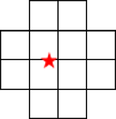

# Snapdragon™ Game Super Resolution

### Table of contents
- [Snapdragon™ Game Super Resolution](#snapdragon-game-super-resolution)
- [Table of contents](#table-of-contents)
- [Introduction](#introduction)
- [Version history](#version-history)
- [References](#references)
- [License](#license)

# Introduction
The **Snapdragon™ Game Super Resolution** (**Snapdragon™ GSR** or **SGSR**) is a group of upscalers tailored to the Adreno™ GPU. **SGSR** provides the best performance on Snapdragon™'s tiled architecture, maximizing visual quality while minimizing memory, processor and battery usage.

| [Snapdragon Game Super Resolution 1](https://github.com/SnapdragonStudios/snapdragon-gsr/tree/main/sgsr/v1) | 
|------|

 

Snapdragon™ Game Studios developed Snapdragon™ Game Super Resolution 1 (Snapdragon™ GSR 1 or SGSR1), which integrates upscaling and sharpening in one single GPU shader pass. The algorithm uses a 12-tap Lanczos-like scaling filter and adaptive sharpening filter, which presents smooth images and sharp edges.

SGSR1 typically offers performance and power savings by allowing a game to render 3D scenes at a lower resolution (with few or no noticeable artifacts introduced by SGSR1's filtered upscaling), while requiring only a single input texture.  

2D UI should generally be rendered and overlaid at device resolution, since upscaling artifacts tend to be more noticeable with a 2D UI pass, and performance and power savings more negligible.

| [Snapdragon Game Super Resolution 2](https://github.com/SnapdragonStudios/snapdragon-gsr/tree/main/sgsr/v2) | 
|------|

 

**Snapdragon™ Game Super Resolution 2** (**Snapdragon™ GSR 2** or just **SGSR 2**) was developed by Qualcomm Snapdragon™ Game Studios; it's our temporal upscaling solution optimized for Adreno GPUs.

Snapdragon™ GSR 2 strikes a better balance between performance and visual quality on mobile devices than other temporal upscaling methods. Its main goal is to improve the quality of the final image by reducing aliasing, flicker, and ghosting while increasing image resolution.

By comparison, TAAU is a simple and fast upscaling version of TAA. It tends to do a good job of reducing aliasing in moving images but also amplifies TAA's shortcomings, such as ghosting. Other alternatives have been developed to produce better perceptual visual quality than TAAU, but these are notoriously slow on mobile GPUs, often introducing compute shader bottlenecks and consuming a lot of power.

Snapdragon™ GSR 2 is an improvement on all fronts, ensuring applications retain their visual fidelity while being easy on power consumption.

# Version history

| Version        | Date              |
| ---------------|-------------------|
| **1.0.0**      | 2023-06-29        |
| **1.1.0**      | 2024-01-29        |
| **2.0.0**      | 2024-10-21        |

# References

**Introducing Snapdragon™ Game Super Resolution**, 
[https://www.qualcomm.com/news/onq/2023/04/introducing-snapdragon-game-super-resolution](https://www.qualcomm.com/news/onq/2023/04/introducing-snapdragon-game-super-resolution)

**Using Super Resolution to Boost Resolution in Virtual Reality**, 
[https://developer.qualcomm.com/blog/using-super-resolution-boost-resolution-virtual-reality](https://developer.qualcomm.com/blog/using-super-resolution-boost-resolution-virtual-reality)

# License
Snapdragon™ Game Super Resolution is licensed under the BSD 3-clause “New” or “Revised” License. Check out the [LICENSE](LICENSE) for more details.
