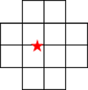
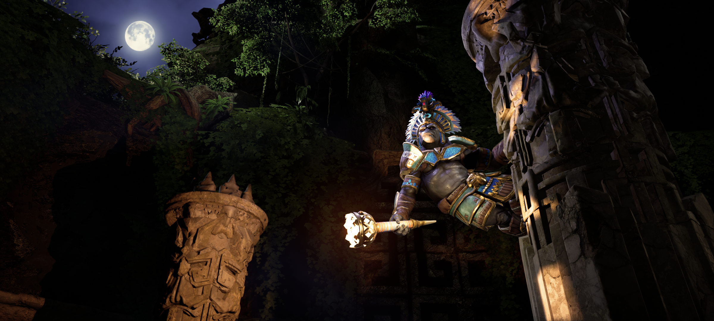
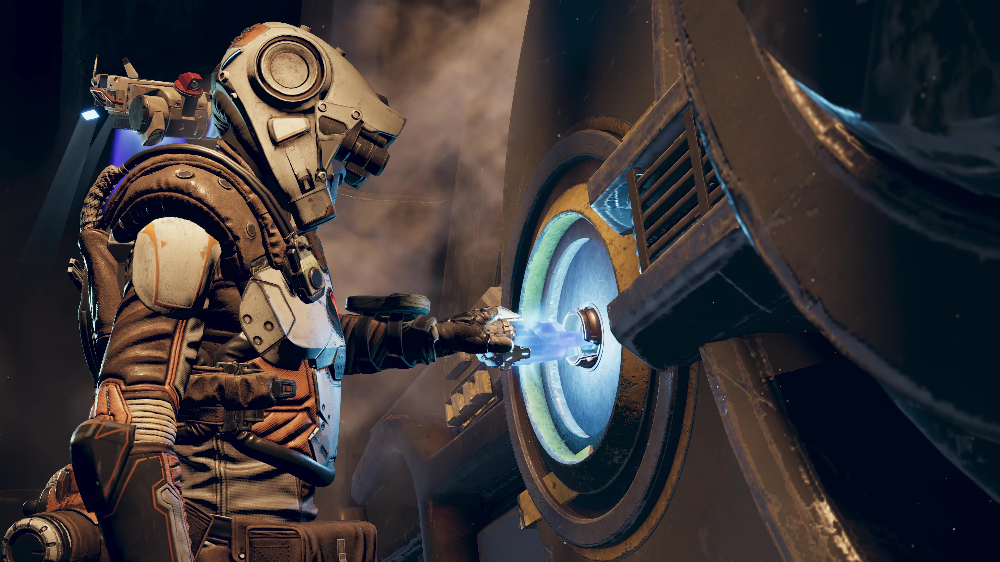
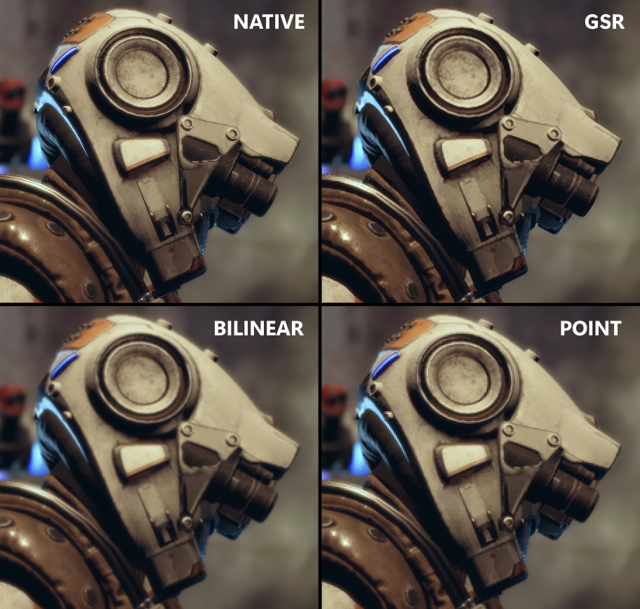

# Snapdragon™ Game Super Resolution

### Table of contents
- [Snapdragon™ Game Super Resolution](#snapdragon-game-super-resolution)
    - [Table of contents](#table-of-contents)
- [Introduction](#introduction)
- [Integration](#integration)
    - [Operation mode](#operation-mode)
    - [Edge direction](#edge-direction)
    - [Edge threshold](#edge-threshold)
    - [Edge sharpness](#edge-sharpness)
    - [Vulkan](#vulkan)
- [Performance](#performance)
  - [Runtime cost on Snapdragon](#runtime-cost-on-snapdragon)
  - [Details visual comparison](#details-visual-comparison)
    - [Artifact (Ray-Tracing enabled)](#artifact-ray-tracing-enabled)
    - [Discovery](#discovery)
- [Other Applications](#other-applications)
- [Version history](#version-history)
- [References](#references)
- [License](#license)

# Introduction
Snapdragon™ Game Studios developed **Snapdragon™ Game Super Resolution** (**Snapdragon™ GSR** or **SGSR**), which integrates upscaling and sharpening in one single GPU shader pass. The algorithm uses a 12-tap Lanczos-like scaling filter and adaptive sharpening filter, which presents smooth images and sharp edges.

Our solution provides an efficient solution for games to draw 2D UI at device resolution for better visual quality, while rendering the 3D scene at a lower resolution for performance and power savings. 

The technique has visual quality on par with other spatial upscaling techniques while being highly optimized for Adreno™ GPU hardware

*Visual comparison with Bilinear*

# Integration

**_NOTE:_** A sample demonstrating how to use the super resolution shaders can be found at our [Vulkan Framework](https://github.com/SnapdragonStudios/adreno-gpu-vulkan-code-sample-framework/tree/main/samples/sgsr).

**_NOTE:_** Our upscaler is available as [Unreal Engine Plugins](https://github.com/SnapdragonStudios/snapdragon-game-plugins-for-unreal-engine) for all recent engine versions.

--

Our shader provide a set of configurations that can be adjusted to fine tune your needs, these are briefly explained below and can be found directly on the shader file.

The shader requires an input texture (your low-res 3D scene) and viewport rect, it doesn't require an anti-aliased input but works best with one.

### Operation mode

SGSR comes with 3 operation modes: **RGBA**, **RGBY** and **LERP**, by default the shader is set to use **RGBA** (mode 1).

### Edge direction

Improves visual quality by using the edge direction when calculating the weights. Adds a small additional cost to the shader and might lower wave occupancy for some GPUs.

### Edge threshold

We suggest keeping its value as *8.0/255* for mobile applications but changing it to *4.0/255* if targeting VR.

### Edge sharpness

By default this value is set to *2*, but any number in the range *[1.0, 2.0]* can be used.

### Vulkan

If targeting vulkan, uncomment the *UseUniformBlock* define.

# Performance

## Runtime cost on Snapdragon

SGSR is well optimized to run on Adreno™ and generally can provide maximum wave occupancy. Considering input content with a resolution of **1240x576**, the following frame times were measured using our most recent Snapdragon™ chips:

**SGSR**
| Edge Threshold | SD888    | SD8Gen1  | SD8Gen2  |
| ---------------|----------|----------|----------|
| **4**          | 0.4756ms | 0.3563ms | 0.2952ms |
| **8**          | 0.4754ms | 0.3543ms | 0.2939ms |

**BILINEAR/LERP**
|  SD888    | SD8Gen1  | SD8Gen2  |
| ----------|----------|----------|
|  0.2476ms | 0.1963ms | 0.1558ms |

Device configurations at maximum GPU frequency:
* Snapdragon 888 (**2340x1080**)
* Snapdragon 8 Gen1 (**2340x1080**)
* Snapdragon 8 Gen2 (**2400x1600**)

SGSR performance scales lineally with the configured scaling ouput region (configurable on the shader). RGBA shares the exact same speed with RGBY. 

Besides the provided configurations, the frame time also depends on the input texture resolution and final output resolution.

## Details visual comparison

With Snapdragon GSR, **1080p** games can become sharper **4K** games. Games that were only **30 FPS** can be played at **60+ FPS** so graphics look even smoother. And since performance is correlated with power, you can get these features while **extending battery life** and gameplay time.

### Artifact (Ray-Tracing enabled)

Performance and visual comparison of rendering at Native (1080p) resolution vs. using Snapdragon GSR upscaling. This demonstration was created in Unreal Engine 5 with Ray Query shadows at 2 rays per pixel.

*21.7FPS*

*50% screen res upscaled - 60FPS*

### Discovery

Visual comparison of rendering at Native (4K) vs. Bilinear vs. Snapdragon GSR.

*Original*

*Bilinear (lerp)*

*SGSR*

*Closeup*

# Other Applications

The high performance, low latency, single-pass nature of SGSR makes it well suited for XR applications. Unlike other popular super resolution algorithms, SGSR uses only a single GPU pass, so it can be combined with other operations minimizing latency and additional bandwidth.

Although not provided here, our shader can be mixed with AA techniques, potentially saving a lot of application bandwidth.

# Version history

| Version        | Date              |
| ---------------|-------------------|
| **1.0.0**      | 2023-06-29        |

# References

**Introducing Snapdragon Game Super Resolution**, 
[https://www.qualcomm.com/news/onq/2023/04/introducing-snapdragon-game-super-resolution](https://www.qualcomm.com/news/onq/2023/04/introducing-snapdragon-game-super-resolution)

**Using Super Resolution to Boost Resolution in Virtual Reality**, 
[https://developer.qualcomm.com/blog/using-super-resolution-boost-resolution-virtual-reality](https://developer.qualcomm.com/blog/using-super-resolution-boost-resolution-virtual-reality)

# License
Snapdragon™ Game Super Resolution is licensed under the BSD 3-clause “New” or “Revised” License. Check out the [LICENSE](LICENSE) for more details.
