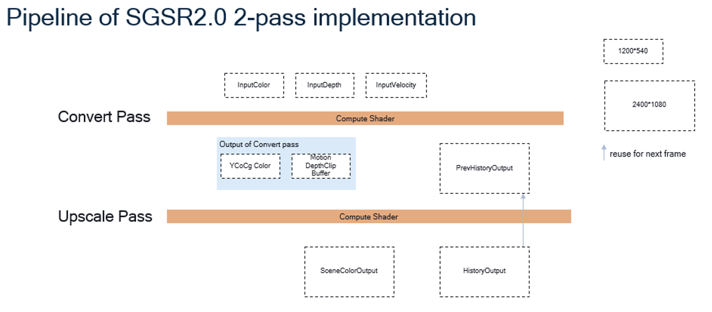
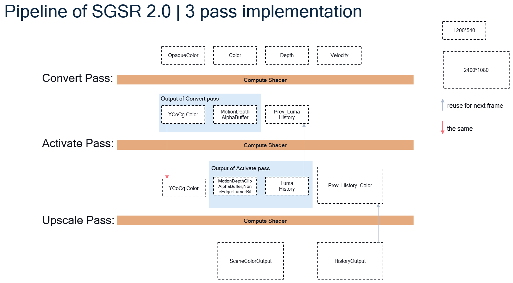
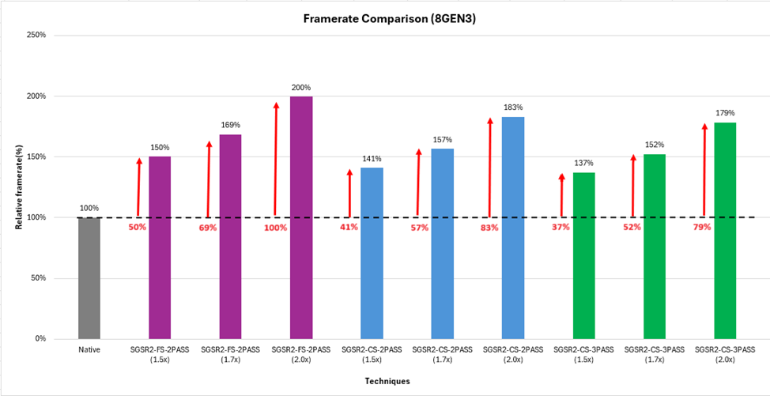
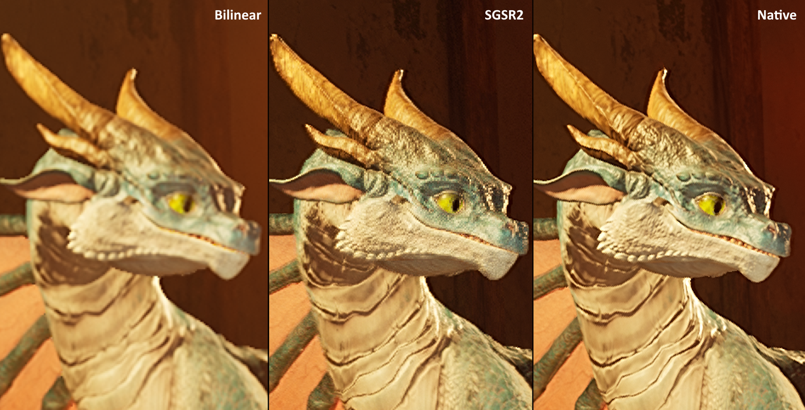

# Snapdragon™ Game Super Resolution 2

### Table of contents
- [Snapdragon™ Game Super Resolution 2](#snapdragon-game-super-resolution)
    - [Table of contents](#table-of-contents)
- [Introduction](#introduction)
- [Integration](#integration)
- [Performance](#performance)
- [Visuals](#visuals)
- [License](#license)

# Introduction


<br>

**Snapdragon™ Game Super Resolution 2** (**Snapdragon™ GSR 2** or just **SGSR 2**) was developed by Qualcomm Snapdragon™ Game Studios; it's our temporal upscaling solution optimized for Adreno GPUs.

Snapdragon™ GSR 2 strikes a better balance between performance and visual quality on mobile devices than other temporal upscaling methods. Its main goal is to improve the quality of the final image by reducing aliasing, flicker, and ghosting while increasing image resolution.

By comparison, TAAU is a simple and fast upscaling version of TAA. It tends to do a good job of reducing aliasing in moving images but also amplifies TAA's shortcomings, such as ghosting. Other alternatives have been developed to produce better perceptual visual quality than TAAU, but these are notoriously slow on mobile GPUs, often introducing compute shader bottlenecks and consuming a lot of power.

Snapdragon™ GSR 2 is an improvement on all fronts, ensuring applications retain their visual fidelity while being easy on power consumption.

### Variants:

- **2-pass-fs  (recommended)**: Uses 2 fragment shaders, favors speed, and is often optimal for Mobile and VR/XR applications.
- **2-pass-cs**: Uses 2 compute shaders, favors speed, and is often optimal for Mobile and VR/XR applications.
- **3-pass-cs**: Uses 3 compute shaders, favors visuals, and is often optimal for Desktop/Console and higher-end Mobile applications.

# Integration

**_NOTE:_** A sample demonstrating how to use the super resolution shaders can be found at our [Vulkan Framework](https://github.com/SnapdragonStudios/adreno-gpu-vulkan-code-sample-framework/tree/main/samples/sgsr2).

**_NOTE:_** Our upscaler is available as [Unreal Engine Plugins](https://github.com/SnapdragonStudios/snapdragon-game-plugins-for-unreal-engine) for all recent engine versions.

--

SGSR 2 is invoked by (depending on the desired variant) dispatching the appropriate pipelines: Activate (*3-pass only*), Convert and Upscale.

### Uniform Buffer Considerations

All shaders consume a UBO of the below format (note that *std140* or *std430* may require different datafield offsets):
```glsl
vec2     renderSize;             /**< Render size                                                                             	*/
vec2     displaySize;            /**< Display size                                                                            	*/
vec2     renderSizeRcp;          /**< 1.0 / renderSize                                                                        	*/
vec2     displaySizeRcp;         /**< 1.0 / displaySize                                                                       	*/
vec2     jitterOffset;           /**< Ranges from [-0.5, 0.5], calculated using the Halton sequence 
                                      (scale it down with the size of view and offset projection matrix)                      	*/
vec4     clipToPrevClip[4];      /**< Convert current clip space position to previous clip scape position*                    	*/
float    preExposure;            /**< Exposure for tone mapping**                                                             	*/
float    cameraFovAngleHor;      /**< Horizontal camera FOV***                                                                  	*/
float    cameraNear;             /**< Near plane of the camera                                                                	*/
float    minLerpContribution;    /**< Fixed interpolation scale; used in 2-pass method only                                   	*/
uint     bSameCamera;            /**< Indicates if it's the same camera from the previous frame; used in 2-pass method only****	*/
uint     reset;                  /**< If accumulation should be reset -- eg last scene != current scene as in a camera cut      */
```
<br>

**\*** Normally defined by `<previous_view_proj> * <inv_current_view_proj>`:
```glsl
glm::mat4 inv_view = glm::inverse(current_view);
glm::mat4 inv_proj = glm::inverse(current_proj);
glm::mat4 inv_vp   = inv_view * inv_proj;
glm::mat4 mt       = (previous_view_proj * inv_vp);
```
**\*\*** Calculated as `<previous_pre_exposure> / <current_pre_exposure\>` where *pre_exposure* is the exposure of the scene before tone mapping.<br>
**\*\*\*** Calculated as `tan(<camera_vertical_fov> / 2.0 ) * <render_width> / <render_height>` or `tan(<camera_horizontal_fov> / 2.0 )` (radians).<br>
**\*\*\*\*** Calculated as:
```c++
uint32_t bSameCamera  = 0;
float    cameraFactor = abs(mt[0][0] - 1.0) + abs(mt[1][1] - 1.0) + abs(mt[2][2] - 1.0) + abs(mt[3][3] - 1.0)
                      + abs(mt[1][0]) + abs(mt[1][2]) + abs(mt[1][3])
                      + abs(mt[2][0]) + abs(mt[2][1]) + abs(mt[2][3])
                      + abs(mt[3][0]) + abs(mt[3][1]) + abs(mt[3][2]);
if (cameraFactor < 1e-5) bSameCamera = 1;
```

### Pass NDC Considerations

Vulkan Y-axes point in the opposite direction in viewport UV and NDC:
1) The *ScreenPos* in the Convert pass should be calculated as `vec2 ScreenPos = vec2(2.0f * ViewportUV.x - 1.0f, 1.0f - 2.0f * ViewportUV.y)`. 
2) The *PrevUV* in the Activate and Upscale passes should be calculated as `vec2 PrevUV = vec2(-0.5f * motion.x + ViewportUV.x, 0.5f * motion.y + ViewportUV.y)`.<br>

If you use inverted depth (or "reverse-z": 1 for the near plane and 0 for the far plane), change the *NearstZ* calculation from `min` to `max` in the Convert pass, and change the *depthclip* condition from `if (depth < 1.0 - 1.0e-05f)` to `if (depth > 1.0e-05f)`.

Take a look at *REQUEST_NDC_Y_UP* definitions on SGSR2 shaders.

## 2-Pass

The Activate pass requires 3 input textures from the application: *InputColor*, *InputDepth* and *InputVelocity*.

The Upscale pass outputs *SceneColorOutput*, which is the resulting texture upscaled. From there you can proceed according to your application needs (merging UI elements, etc).

 <br>

Shaders are located at [include/glsl_2_pass](https://github.com/SnapdragonStudios/snapdragon-gsr/sgsr/v2/include/glsl_2_pass).

**1) The Convert Pass**

Depthclip values are calculated based on current depth and reprojected previous depth. Luma history and current values are processed and "None Edge" and "Luma Highlighted-bit" are derived.

Every frame **PrevLumaHistory** and **LumaHistory** should be swapped.

- Inputs

|    Name	        | Resolution	| Format                | Type   | Notes |
| :-----            | :----         | :----                 | :----  | :-------------------------------- |
| InputColor	    | Render        | RGBA\*                | texture|	The color texture for the current frame. Provided by the application.|
| InputDepth	    | Render        | D24S8                 | texture|	The depth texture for the current frame. Provided by the application.|
| InputVelocity	    | Render        | RGBA                  | texture|	The motion vectors in clip space for the current frame.  Provided by the application. Should be encoded as: out = velocity * 0.2495 + 32767.0f / 65535.0f. Calculated for dynamic objects only -- pass zero for static objects. |

- Outputs

|    Name	             | Resolution	| Format  | Type   | Notes |
| :-----                 | :----        | :----   | :----  | :---- |
| MotionDepthClipBuffer  | Render	    | RGBA16F | texture| The texture used to store motion, depthClip, and alpha mask. Internal resource of SGSR2.|
| Colorluma  	         | Render	    | R32UI   | texture| The YCoCg texture created internally.|


**2) The Upscale Pass**

Obtain the upsampled color: apply a Lanczos filter to 9 samples of the YCoCg Color image to get the min/max/variance color in Y/Co/Cg channels, then clamp the history color with the min/max/variance color and interpolate between the clamped history color and original history color -- and at last, generate the final color by interpolating the upsampled color and the history color.

Every frame **PrevHistory** and **HistoryOutput** should be swapped.

- Inputs

|    Name	                 | Resolution	| Format  | Type   | Notes |
| :-----                     | :----        | :----   | :----  | :---- |
| MotionDepthClipBuffer 	 | Render	    | RGBA16F | texture| Derived in Convert pass. Internal resource of SGSR2.|
| Colorluma                  | Render       | R32UI   | texture| Derived in Convert pass. Internal resource of SGSR2.|
| PrevHistory                | Display      | RGBA\*  | texture| The HistoryOutput of the upscale pass in previous frame. Internal resource of SGSR2.|

- Outputs

|    Name	                 | Resolution	| Format  | Type   | Notes |
| :-----                     | :----        | :----   | :----  | :---- |
| SceneColorOutput           | Display	    | RGBA\*  | texture| The upscaled texture. Provided by the application.|
| HistoryOutput              | Display      | RGBA\*  | texture| The processed history color texture. Internal resource of SGSR2.|

\* Any RGBA type can be used as long as all marked textures follow the same format

## 3-Pass

The Activate pass requires 4 input textures from the application: *InputOpaqueColor*, *InputColor*, *InputDepth* and *InputVelocity*.

The Upscale pass outputs *SceneColorOutput*, which is the resulting texture upscaled. From there you can proceed according to your application's needs (merging UI elements, etc).

 <br>

Shaders are located at [include/glsl_3_pass](https://github.com/SnapdragonStudios/snapdragon-gsr/sgsr/v2/include/glsl_3_pass).

**1) The Convert Pass**

Dilates depth by calculating the nearest depth of a 3x3 block of pixels. Derives motion from the input velocity -- or reprojects depth if no velocity is available. Computes the alpha mask for translucent objects and convert the input color to YCoCg format.

- Inputs

|    Name	        | Resolution	| Format                | Type   | Notes |
| :-----            | :----         | :----                 | :----  | :-------------------------------- |
| InputOpaqueColor	| Render	    | RGBA\*                | texture|	The color texture before drawing transparent objects. Provided by the application. If transparency isn't needed, set this parameter equal to the Color parameter.|
| InputColor	    | Render        | RGBA\*                | texture|	The color texture for the current frame. Provided by the application.|
| InputDepth	    | Render        | D24S8                 | texture|	The depth texture for the current frame. Provided by the application.|
| InputVelocity	    | Render        | RGBA                  | texture|	The motion vectors in clip space for the current frame. Provided by the application. Should be encoded as: out = velocity * 0.2495 + 32767.0f / 65535.0f. Calculated for dynamic objects only -- pass zero for static objects. |

- Outputs

|    Name	             | Resolution	| Format  | Type   | Notes |
| :-----                 | :----        | :----   | :----  | :---- |
| Colorluma  	         | Render	    | R32UI   | texture| The YCoCg texture created internally.|
| MotionDepthAlphaBuffer | Render       | RGBA16F | texture| The texture used to store motion, depth, and alpha mask. Internal resource of SGSR2.|

**2) The Activate Pass**

Depthclip values are calculated based on current depth and reprojected previous depth. Luma history and current values are processed and "None Edge" and "Luma Highlighted-bit" are derived.

Every frame **PrevLumaHistory** and **LumaHistory** should be swapped.

- Inputs

|    Name	             | Resolution	| Format  | Type   | Notes |
| :-----                 | :----        | :----   | :----  | :---- |
| PrevLumaHistory  	     | Render	    | R32UI   | texture| The LumaHistory from previous frame. Internal resource of SGSR2. |
| MotionDepthAlphaBuffer | Render       | RGBA16F | texture| Derived in Convert pass. Internal resource of SGSR2.|
| Colorluma              | Render       | R32UI   | texture| Derived in Convert pass. Internal resource of SGSR2.|

- Outputs

|    Name	                 | Resolution	| Format  | Type   | Notes |
| :-----                     | :----        | :----   | :----  | :---- |
| MotionDepthClipAlphaBuffer | Render	    | RGBA16F | texture| The texture used to store motion, depthClip, and alpha mask. Internal resource of SGSR2.|
| LumaHistory                | Render       | R32UI   | texture| The texture stores luma value of current frame and luma difference between current frame and previous frame. Internal resource of SGSR2.|

**3) The Upscale Pass**

Obtain the upsampled color: apply a Lanczos filter to 9 samples of the YCoCg Color image to get the min/max/variance color in Y/Co/Cg channels, then clamp the history color with the min/max/variance color and interpolate between the clamped history color and original history color -- and at last, generate the final color by interpolating the upsampled color and the history color.

Every frame **PrevHistory** and **HistoryOutput** should be swapped.

- Inputs

|    Name	                 | Resolution	| Format  | Type   | Notes |
| :-----                     | :----        | :----   | :----  | :---- |
| MotionDepthClipAlphaBuffer | Render	    | RGBA16F | texture| Derived in Convert pass. Internal resource of SGSR2.|
| Colorluma                  | Render       | R32UI   | texture| Derived in Convert pass. Internal resource of SGSR2.|
| PrevHistory                | Display      | RGBA\*  | texture| The HistoryOutput of the upscale pass in previous frame. Internal resource of SGSR2.|

- Outputs

|    Name	                 | Resolution	| Format | Type   | Notes |
| :-----                     | :----        | :----  | :----  | :---- |
| SceneColorOutput           | Display	    | RGBA\* | texture| The upscaled texture. Provided by the application.|
| HistoryOutput              | Display      | RGBA\* | texture| The processed history color texture. Internal resource of SGSR2.|

\* Any RGBA type can be used as long as all marked textures follow the same format

# Performance

The performance values from the table below were gathered from a Snapdragon 8 Gen 3 at maximum GPU frequency.

<table>
  <tr>
    <th colspan="2">2.0x (630x1400 to 1260x2800)</th>
    <th colspan="2">1.7x (740x1648 to 1260x2800)</th>
    <th colspan="2">1.5x (840x1866 to 1260x2800)</th>
  </tr>
  <tr>
    <th>SGSR Variant</th>
    <th>Time(ms)</th>
    <th>SGSR Variant</th>
    <th>Time(ms)</th>
    <th>SGSR Variant</th>
    <th>Time(ms)</th>
  </tr>
  <tr>
    <td>2 pass-CS</td>
    <td>1.801</td>
    <td>2 pass-CS</td>
    <td>1.910</td>
    <td>2 pass-CS</td>
    <td>1.998</td>
  </tr>
  <tr>
    <td>2 pass-FS</td>
    <td>0.905</td>
    <td>2 pass-FS</td>
    <td>1.024</td>
    <td>2 pass-FS</td>
    <td>1.107</td>
  </tr>
  <tr>
    <td>3 pass-CS</td>
    <td>2.015</td>
    <td>3 pass-CS</td>
    <td>2.199</td>
    <td>3 pass-CS</td>
    <td>2.397</td>
  </tr>
</table>

<br>



## Visuals

With Snapdragon GSR 2, **1080p** games can become sharper **4K** games. Games that could sustain only **30 FPS** can be played at **60+ FPS** for silky smooth motion. And since performance is correlated with power, you can get these features while **extending battery life** and gameplay time.



<br>

It's an imense improvement over its first version:


<sub><sub>SGSR1 vs SGSR2 respectively</sub></sub>
<br>


<sub><sub>SGSR1 vs SGSR2 respectively</sub></sub>
<br>

# License
Snapdragon™ Game Super Resolution is licensed under the BSD 3-clause “New” or “Revised” License. Check out the [LICENSE](LICENSE) for more details.
